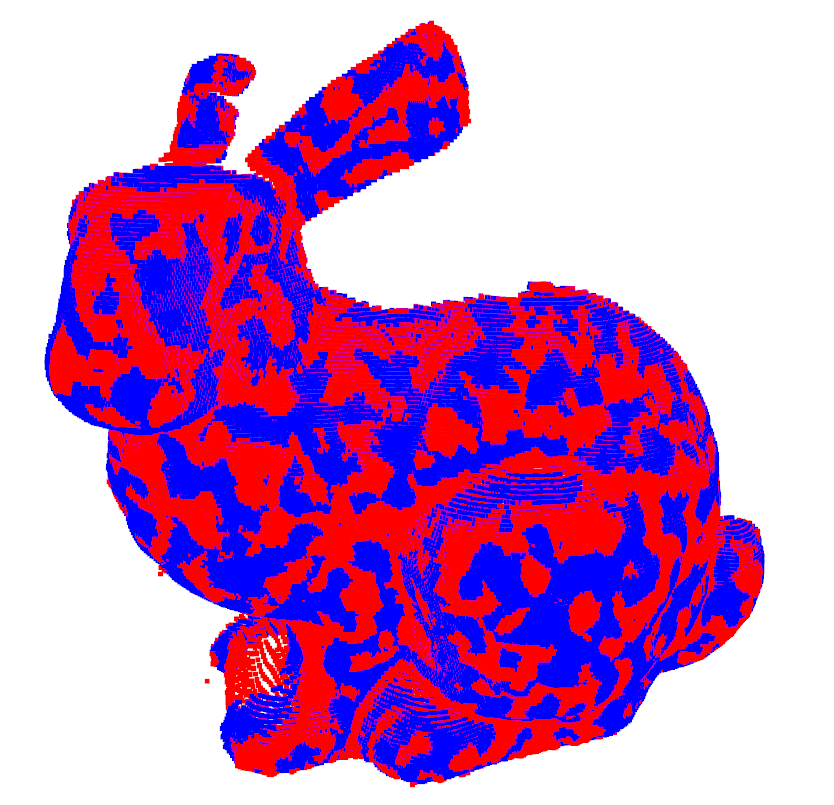

Jupyter implementation of the STORED. Simply run _stored.ipynb_ on jupyter notebook.

# The Final Result for Outlier Removal and Noise Correction
The Quantitative evaluation for the following figure is given:
F1 score : 0.904
Recall : 0.970
Precision : 0.846
Majority of outliers have been removed, while preserving meaningful features.

# Result (red) comparison with the ground truth (blue)

