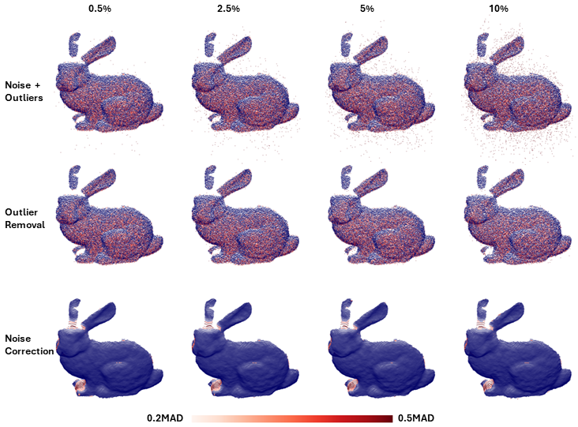

# STORED
3D Point Cloud outlier detection and noise correction using Gaussian Process Regression. The STORED is designed for Point Cloud (PCD) outlier removal and denoising at single-perspective scanning level, before PCD registration. The computational cost for training is $On^3$, and $On^2m$ for prediction, where $n$ is the training dataset $m$ is the prediction dataset. Therefore, the STORED can be implemented in **real time** when the input PCD is small in size. Implementation in both _Jupyter Notebook_ and _Python_ are provided.




# Prerequisites
Tested with:

python == 3.9.19

torch == 2.3.1+cu121

torchvision == 0.18.1+cu121

gpytorch == 1.11


# Outlier Detection

You can classify outliers

``` bash
device = torch.device("cuda" if torch.cuda.is_available() else "cpu")
xyz = np.load('path/to/your/pointcloud')
hyp_opt, tuned_model = tune_gpr(device, xyz, GPModel, n_sample, n_iter, min_iter, convergence_tol, early_stopping_patience)
mean_all, std_all = exact_gp(device, xyz, GPModel, hyp_opt, n_sample, num_epochs, pred_batch = True, batch_size = False, pred_dataset = [])
score_final = score(mean_all, std_all, xyz)
outlier_pred = score_final>t
```

User must define threshold (t). Higher scores suggest higher outlier likelihood.


# Denoising

You can correct noise

``` bash
hyp_opt, tuned_model = tune_gpr(device, xyz, GPModel, n_sample, n_iter, min_iter, convergence_tol, early_stopping_patience)
mean_all, std_all = exact_gp(device, xyz, GPModel, hyp_opt, n_sample, num_epochs, pred_batch = True, batch_size = False, pred_dataset = [])
weighted_prediction = weighted_pred(mean_all, std_all)
```

Use lower _n_iter_ for better noise correction. Higher _n_iter_ results in over-training. Suggested range is 5~20.

# To run a demo (Python)

``` bash
python sample.py
```

# To run on command line (Python)
``` bash
python create_noisy_pcd.py --filename "{your_dataset}.npy" --sample_size [your_sample_size] --iter [your_iter]
python outlier_score.py --filename "{your_dataset}_noisy.npy" --sample_size [your_sample_size] --iter [your_iter]
python outlier_removal.py --filename "{your_dataset}_noisy.npy" --score [your_threshold]
python noise_correction.py --filename "{your_dataset}.npy" --sample_size [your_sample_size] --iter [your_iter] --pred_batch [True or False] --predset [your_prediction_set]

```
# To run a demo (Jupyter)
Simply run _stored.ipynb_
