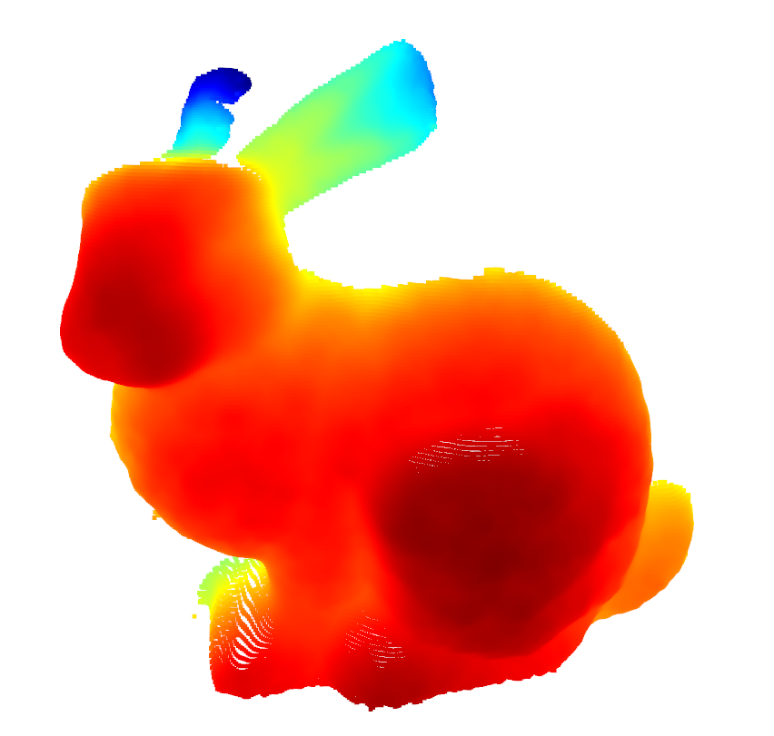
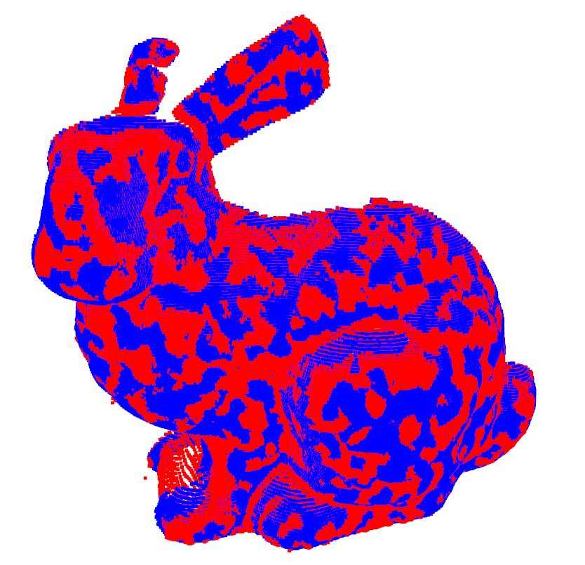

# Python implementation of the STORED


# File Details

* _gprgpu_toolkit.py_ contains Gaussian Process Regression Model, tools to tune hyperparameters, and predict with standard deviation
* _utils.py_ contains visualization codes, metrics, normalization, etc
* _sample.py_ contains jupyter notebook code for running a sample outlier detection and denoising for the front angle scan of _Stanford Bunny_. (Full Dataset can be retrieved from [The Stanford 3D Scanning Repository](https://graphics.stanford.edu/data/3Dscanrep)).
* _create_noisy_pcd.py_ creates noisy point cloud with outliers defined with the Median Absolute Deivation (MAD) and multiplier. The points that deviate from the ground truth with Euclidean distance larger than MAD \times multiplier is considered to be outliers. Gaussian noise is added to the remaining points.
* _outlier_score.py_ assigns score to the entire point cloud using GPR. Higher scores signify higher outlier-likelihood.
* _outlier_removal.py_ removes outliers based on the user-defined threshold. Higher threshold applies stricter filter.
* _noise_correction.py_ corrects noise using GPR. Run after outlier_removal.py for better performance, given that both the outliers and noise exist.

# To run a demo

``` bash
python sample.py
```

# To run on command line
``` bash
python create_noisy_pcd.py --filename "{your_dataset}.npy" --sample_size [your_sample_size] --iter [your_iter]
python outlier_score.py --filename "{your_dataset}_noisy.npy" --sample_size [your_sample_size] --iter [your_iter]
python outlier_removal.py --filename "{your_dataset}_noisy.npy" --score [your_threshold]
python noise_correction.py --filename "{your_dataset}.npy" --sample_size [your_sample_size] --iter [your_iter] --pred_batch [True or False] --predset [your_prediction_set]

```

# The Final Result for Outlier Removal and Noise Correction
The Quantitative evaluation for the following figure is given:
F1 score : 0.904
Recall : 0.970
Precision : 0.846
Majority of outliers have been removed, while preserving meaningful features.


# Result (red) comparison with the ground truth (blue)

